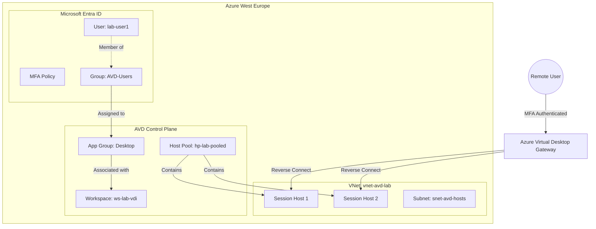

# Enterprise VDI Lab on Azure
**Author:** Luiz Paulo Estevez Todeschini

## Overview
This project is a personal, non-production lab designed to reconstruct a simplified version of a modern enterprise Virtual Desktop Infrastructure (VDI) environment using Microsoft Azure.

The lab simulates a cloud-first, identity-centric workspace commonly found in large-scale operations such as contact centers or secure access workstation scenarios. It leverages Azure Virtual Desktop (AVD), Microsoft Entra ID for centralized identity management, and enforced Multi-Factor Authentication (MFA).

The environment is deployed using Infrastructure as Code (Terraform), focusing on consistency, repeatability, and architectural clarity rather than production completeness.

**Purpose**

The purpose of this project is educational and demonstrative. It aims to document architectural decisions, security trade-offs, and operational patterns commonly used in enterprise VDI environments, while remaining intentionally simplified for lab and portfolio use.

This project is not intended for production deployment.

## Architecture

The solution uses a **Hub-spoke** inspired network design (simplified to a single VNet for the lab) hosting Windows 11 Enterprise Multi-session hosts joined directly to Entra ID (AAD Join), eliminating the need for legacy Active Directory Domain Controllers.



## Components

| Component | Description |
|-----------|-------------|
| **Microsoft Entra ID** | Central identity provider. Manages users (`lab-user1`, `lab-user2`), groups (`AVD-Users`), and enforces security policies. |
| **Azure Virtual Desktop** | PaaS service for VDI. Includes the **Workspace** (user entry point), **Host Pool** (pooled compute resources), and **Application Group** (publishing the full desktop). |
| **Session Hosts** | **Windows 11 Enterprise Multi-session** VMs. These allow multiple concurrent users on a single VM, optimizing cost. Configured with **Entra ID Join** for modern management. |
| **Virtual Network** | Provides network isolation for the session hosts. In a production scenario, this would peer with a Hub VNet containing an Azure Firewall for secured egress. |

## Deployment

### Prerequisites
- Azure Subscription with permissions to create Resources and Entra ID Users.
- [Terraform](https://www.terraform.io/) installed.
- [Azure CLI](https://docs.microsoft.com/cli/azure/install-azure-cli) installed and authenticated (`az login`).

### Deployment Steps

1. **Clone the repository:**
   ```bash
   git clone https://github.com/juntosvamosA-CEO/azure-demo.git
   cd azure-demo/infra
   ```

2. **Initialize Terraform:**
   ```bash
   terraform init
   ```

3. **Deploy Infrastructure:**
   ```bash
   terraform apply
   ```
   *Review the plan and type `yes` to confirm.*

### Post-Deployment Configuration (Manual)
To fully enforce the security posture, configure the following in the Azure Portal:
1. **Conditional Access**: Create a policy targeting the `AVD-Users` group accessing "Azure Virtual Desktop" app, requiring **MFA**.
2. **Break Glass Account**: Ensure at least one admin account is excluded from this policy to prevent lockout.

## How to Connect

1. **Client**: Download the [Remote Desktop client for Windows](https://learn.microsoft.com/azure/virtual-desktop/users/connect-windows) or use the [Web Client](https://client.wvd.microsoft.com/arm/webclient/).
2. **Login**: Use the credentials for `lab-user1@<your-tenant>.onmicrosoft.com` (password defined in Terraform or changed on first login).
3. **MFA**: Complete the MFA challenge if configured.
4. **Launch**: Click on **"Lab Desktop"** to open your cloud PC session.

## Hardening & Next Steps

For a production-grade evolution of this lab, the following enhancements are recommended:
- **FSLogix Profile Containers**: Store user profiles on Azure Files to provide a seamless "roaming" experience in non-persistent pools.
- **Secure Egress**: Route all internet traffic through **Azure Firewall** in a Hub VNet to filter malicious content.
- **Endpoint Security**: Deploy **Microsoft Defender for Endpoint** to session hosts for EDR capabilities.

**Intentional Limitations**
The following elements are intentionally out of scope for this lab:

-On-premises or hybrid Active Directory
-Full hub-spoke networking with Azure Firewall
-SIEM and centralized security monitoring
-Automated scaling plans

Advanced image lifecycle pipelines
- **Image Management**: Use **Azure Compute Gallery** to maintain hardened "Golden Images" with pre-installed business applications.

## About the Author


